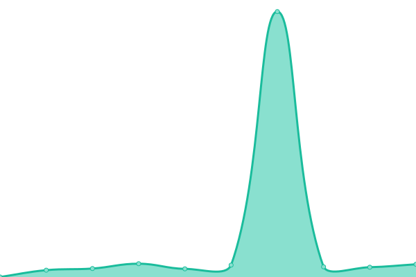
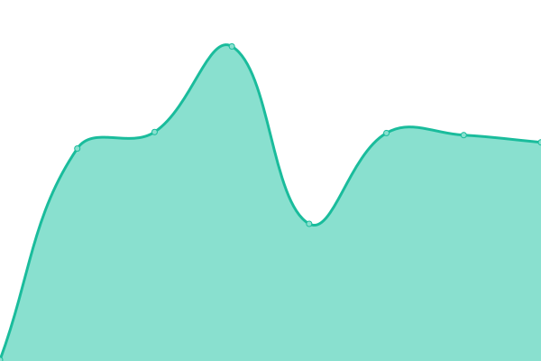
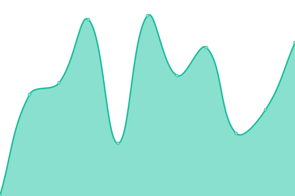
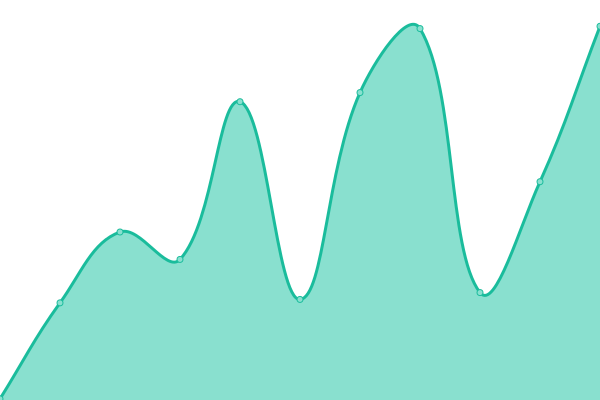
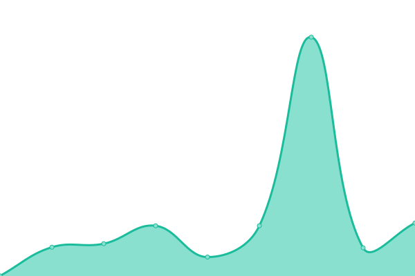
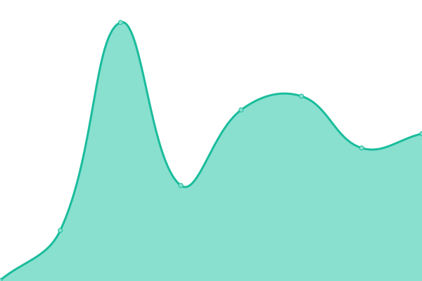
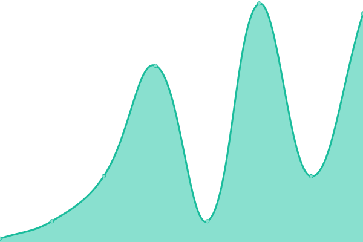

# [📈 Live Status](https://status.buape.com): <!--live status--> **🟧 Partial outage**

This repository contains the open-source uptime monitor and status page for [Buape Studios](https://buape.com), powered by [Upptime](https://github.com/upptime/upptime).

With [Upptime](https://upptime.js.org), you can get your own unlimited and free uptime monitor and status page, powered entirely by a GitHub repository. We use [Issues](https://github.com/buape/status/issues) as incident reports, [Actions](https://github.com/buape/status/actions) as uptime monitors, and [Pages](https://status.buape.com) for the status page.

<!--start: status pages-->
<!-- This summary is generated by Upptime (https://github.com/upptime/upptime) -->
<!-- Do not edit this manually, your changes will be overwritten -->
<!-- prettier-ignore -->
| URL | Status | History | Response Time | Uptime |
| --- | ------ | ------- | ------------- | ------ |
|  [Kiai: Bot](http://host.buape.com:6677) | 🟥 Down | [kiai-bot.yml](https://github.com/buape/status/commits/HEAD/history/kiai-bot.yml) | 

 396ms
     
 | 

<a href="https://status.buape.com/history/kiai-bot">99.74%</a>
    

|  [Kiai: Website](https://www.kiaibot.com) | 🟩 Up | [kiai-website.yml](https://github.com/buape/status/commits/HEAD/history/kiai-website.yml) | 

 216ms
     
 | 

<a href="https://status.buape.com/history/kiai-website">100.00%</a>
    

|  [Kiai: API](https://api.kiaibot.com) | 🟥 Down | [kiai-api.yml](https://github.com/buape/status/commits/HEAD/history/kiai-api.yml) | 

 203ms
     
 | 

<a href="https://status.buape.com/history/kiai-api">99.75%</a>
    

|  [Kiai: Docs](https://docs.kiaibot.com) | 🟩 Up | [kiai-docs.yml](https://github.com/buape/status/commits/HEAD/history/kiai-docs.yml) | 

 151ms
     
 | 

<a href="https://status.buape.com/history/kiai-docs">100.00%</a>
    

|  [Unleash](https://unleash.kiaibot.com) | 🟥 Down | [unleash.yml](https://github.com/buape/status/commits/HEAD/history/unleash.yml) | 

 174ms
     
 | 

<a href="https://status.buape.com/history/unleash">34.40%</a>
    

|  [go.buape.com (Link Shortener)](https://go.buape.com) | 🟩 Up | [go-buape-com-link-shortener.yml](https://github.com/buape/status/commits/HEAD/history/go-buape-com-link-shortener.yml) | 

 218ms
     
 | 

<a href="https://status.buape.com/history/go-buape-com-link-shortener">100.00%</a>
    

|  [Buape Files](https://files.buape.com) | 🟩 Up | [buape-files.yml](https://github.com/buape/status/commits/HEAD/history/buape-files.yml) | 

 638ms
     
 | 

<a href="https://status.buape.com/history/buape-files">99.78%</a>
    

|  [Buape CDN](https://cdn-raw.buape.com/buape_circle.png) | 🟩 Up | [buape-cdn.yml](https://github.com/buape/status/commits/HEAD/history/buape-cdn.yml) | 

 215ms
     
 | 

<a href="https://status.buape.com/history/buape-cdn">100.00%</a>
    

|  [Server: Buape1](host.buape.com) | 🟩 Up | [server-buape1.yml](https://github.com/buape/status/commits/HEAD/history/server-buape1.yml) | 

 25ms
     
 | 

<a href="https://status.buape.com/history/server-buape1">100.00%</a>
    

<!--end: status pages-->

[**Visit our status website →**](https://status.buape.com)

## 📄 License

- Powered by: [Upptime](https://github.com/upptime/upptime)
- Code: [MIT](./LICENSE) © [Anand Chowdhary](https://anandchowdhary.com), supported by [Pabio](https://pabio.com)
- Data in the `./history` directory: [Open Database License](https://opendatacommons.org/licenses/odbl/1-0/)
